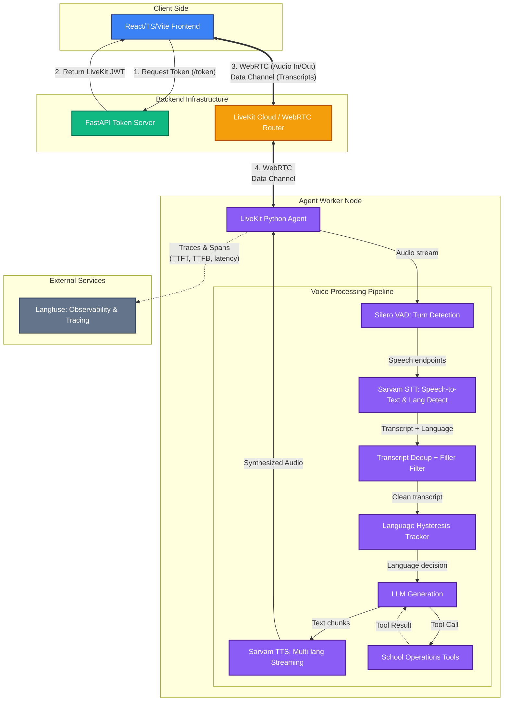

# Voice AI Agent for Indian Schools

A conversational voice agent for schools across India. Supports **11 Indian languages** with **automatic detection**, tuned for **low latency**, **classroom noise**, and **natural interruptions**.

Built on [LiveKit Agents](https://github.com/livekit/agents) + [Sarvam AI](https://sarvam.ai) (STT, TTS, LLM) with configurable LLM providers (Sarvam, OpenAI, Groq) and production-grade tracing via [Langfuse v4](https://langfuse.com).

## Architecture



### Component Breakdown

1. **Client Side**: React 19 + TypeScript + Vite SPA using `@livekit/components-react`. Fetches a token via `TokenSource.endpoint('/token')` and connects to LiveKit Cloud. Renders audio visualizer, chat transcript, and language chips from data channel messages.
2. **Backend Infrastructure**: FastAPI Token Server issues secure LiveKit JWTs (GET + POST endpoints). Serves built frontend as SPA with fallback routing. LiveKit Cloud acts as the WebRTC SFU and provides BVC noise cancellation.
3. **Agent Worker Node**: Core orchestration layer. Silero VAD for endpointing, Sarvam STT for speech-to-text and language detection, configurable LLM for responses, and native Sarvam streaming TTS. Sarvam's supported plugin API owns the WebSocket pool and cancellation lifecycle. Includes filler suppression, transcript deduplication, language hysteresis, and rolling conversation summarization.
4. **External Services**: Langfuse captures hierarchical telemetry — session traces, per-turn spans, STT/LLM/TTS observability (TTFT, TTFB), tool call latency, language switch events, and interruption tracking.

### Latency budget

| Stage | Time |
|---|---|
| Browser to LiveKit | 20-40ms |
| Sarvam STT | ~70ms |
| Endpointing delay | 300-800ms |
| LLM first token | 150-400ms (varies by provider) |
| Sarvam TTS (first byte) | 100-200ms |
| LiveKit to Browser | 20-40ms |
| **Total** | **~400-860ms** |

## Quick start

### Prerequisites

- Python 3.10+
- Node.js 20+
- [LiveKit Cloud](https://cloud.livekit.io) account (free)
- [Sarvam AI](https://dashboard.sarvam.ai) API key
- [Langfuse](https://langfuse.com) account (optional, free tier for observability)

### Setup

```bash
cd Voice-AI-Agent

# Install Python dependencies
uv sync

# Install frontend dependencies
cd frontend && npm install && cd ..

# Configure API keys
cp .env.example .env
# Edit .env with your keys
```

### Run

Three terminals needed:

```bash
# Terminal 1 — Token server + API (port 8000)
uv run python server.py

# Terminal 2 — Agent worker
uv run python agent.py dev

# Terminal 3 — Frontend dev server (port 3000, proxies /token to :8000)
cd frontend && npm run dev
```

Open `http://localhost:3000` and click **Connect**. The agent greets you in Hindi and auto-detects your language as you speak.

### CLI testing (no browser)

```bash
uv run python agent.py console
```

### Docker / Hugging Face Spaces

The included `Dockerfile` builds a self-contained image for HF Spaces deployment:

```bash
docker build -t voice-ai-agent .
docker run -p 7860:7860 --env-file .env voice-ai-agent
```

Runs both the agent worker and token server on port 7860, serving the built frontend as a SPA.

## Supported languages

| Language | Code | Speaker | Region |
|---|---|---|---|
| Hindi | `hi-IN` | shubh | North |
| Tamil | `ta-IN` | shubh | South |
| Telugu | `te-IN` | shubh | South |
| Kannada | `kn-IN` | shubh | South |
| Malayalam | `ml-IN` | shubh | South |
| Marathi | `mr-IN` | shubh | West |
| Gujarati | `gu-IN` | shubh | West |
| Bengali | `bn-IN` | shubh | East |
| Odia | `od-IN` | shubh | East |
| Punjabi | `pa-IN` | shubh | North |
| English | `en-IN` | shubh | Pan-India |

All languages use the `shubh` speaker from Sarvam Bulbul v3.

## How language auto-detection works

1. Sarvam STT runs with `language="unknown"` — it auto-detects the spoken language
2. `user_input_transcribed` event stores the detected language code
3. `FillerFilter` drops filler utterances ("hmm", "uh", "ji") — no LLM/TTS triggered
4. `TranscriptDedup` prevents repeated STT finals from duplicate processing
5. `LanguagePolicy` keeps a persistent `confirmed_lang`; TTS always uses that language, never the raw per-turn detection
6. A direct request (for example, “speak English” or “हिंदी में बोलो”) switches immediately; a turn longer than 5 words also switches immediately
7. Short detections require two consecutive turns in the same new language; alternating languages reset the pending count

Set `LANGUAGE_SWITCH_MODE` in `.env` to choose the switching strategy:

| Value | Behavior |
|---|---|
| `policy` (default) | Uses `confirmed_lang`: explicit requests and long turns switch immediately; short turns require two matching detections. |
| `sarvam` | TTS immediately uses Sarvam's supported per-turn detected language. |
8. Transcripts are published to the frontend via LiveKit data channel for real-time chat display

## LLM Providers

The agent supports three LLM providers, selected via the `LLM_PROVIDER` environment variable:

| Provider | Model | Setup |
|---|---|---|
| `sarvam` (default) | `sarvam-30b` | Just needs `SARVAM_API_KEY` |
| `openai` | `gpt-4o-mini` | Set `OPENAI_API_KEY` |
| `groq` | `llama-3.3-70b-versatile` | Set `GROQ_API_KEY` |

Groq uses its OpenAI-compatible endpoint and is streamed directly into TTS. The provider factory validates the selected provider key at startup and applies bounded SDK retries. Rolling summaries use the same selected provider, so Groq sessions do not unexpectedly send conversation history to another LLM.

## Runtime modules

- `agent.py` — LiveKit lifecycle, event handlers, and conversation orchestration.
- `voice_agent/providers.py` — validated Sarvam/OpenAI/Groq LLM and Sarvam STT construction.
- `voice_agent/conversation.py` — independently testable filler filtering, transcript deduplication, and language hysteresis.
- `voice_agent/telemetry.py` — optional Langfuse setup with explicit timeout and opt-out.
- `utils/summarize.py` — provider-aware rolling context summaries.

The agent requires only Sarvam's public TTS methods (`prewarm`, `stream`, and `aclose`). It deliberately does not access private fields such as `_pool` or `_connections`, which keeps upgrades safe.

## Frontend

React 19 + TypeScript + Vite 8 SPA. Uses Tailwind CSS v4, shadcn/ui (Radix UI primitives), and `@livekit/components-react`.

- **Audio visualizer** — animated bar visualizer synced to agent state (connecting/listening/thinking/speaking)
- **Chat transcript** — bubble-style conversation with user and agent messages, auto-scroll, streaming markdown rendering
- **Language chips** — all 11 languages shown; detected language highlights in green
- **Control bar** — microphone toggle, leave room button
- **Start audio button** — browser autoplay unlock prompt

### Build

```bash
cd frontend
npm run dev     # development on http://localhost:3000
npm run build   # production build to frontend/dist/
npm run lint    # ESLint
```

The Vite dev server proxies `/token` to `http://localhost:8000` so no CORS issues in development. In production, `server.py` serves the built frontend from `frontend/dist/` with SPA fallback routing.

## Project structure

```
Voice-AI-Agent/
├── agent.py              # TTS adapter, LiveKit agent, event handlers, entrypoint
├── voice_agent/
│   ├── providers.py      # Provider validation + Sarvam/OpenAI/Groq factories
│   ├── conversation.py   # Filler filter, deduplication, language hysteresis
│   └── telemetry.py      # Optional Langfuse configuration
├── server.py             # FastAPI: GET/POST /token + SPA static file serving
├── config.py             # LanguageConfig, 11 languages, all constants
├── pyproject.toml        # Python dependencies (uv)
├── Dockerfile            # Multi-stage build for HF Spaces
├── .env.example          # API keys template
├── CLAUDE.md             # Claude Code agent context
├── utils/
│   ├── prompts.py        # System prompt (voice-optimised, ~2000 chars)
│   ├── tools.py          # School tools with Langfuse tracing
│   └── summarize.py      # Rolling conversation summarization
└── frontend/
    ├── src/
    │   ├── App.tsx                          # Root — AgentSessionProvider + AgentUI
    │   ├── main.tsx                         # React 19 entrypoint
    │   ├── index.css                        # Tailwind CSS v4 import
    │   ├── hooks/
    │   │   ├── useTranscripts.ts            # LiveKit data channel listener
    │   │   └── agents-ui/                   # Audio visualizer + control bar hooks
    │   ├── components/
    │   │   ├── LanguageBar.tsx              # 11 language chips
    │   │   ├── agents-ui/                   # LiveKit agent UI components
    │   │   │   ├── agent-session-provider.tsx
    │   │   │   ├── agent-control-bar.tsx
    │   │   │   ├── agent-chat-transcript.tsx
    │   │   │   ├── agent-audio-visualizer-bar.tsx
    │   │   │   └── start-audio-button.tsx
    │   │   ├── ai-elements/                 # AI conversation/message primitives
    │   │   └── ui/                          # shadcn/ui base components
    │   └── lib/
    │       └── utils.ts                     # cn() utility (clsx + tailwind-merge)
    ├── package.json
    ├── vite.config.js
    ├── tsconfig.json
    ├── components.json                      # shadcn/ui config
    └── index.html
```

## Key optimizations

- **Silero VAD** — dedicated voice activity detection following LiveKit's recommended pattern
- **Dynamic endpointing** — `min_delay=300ms`, `max_delay=800ms`, `alpha=0.7` — responsive tuning for fast Indian-language turn-taking
- **Preemptive TTS** — starts synthesis as soon as LLM produces first tokens, reducing time-to-first-audio. Preemptive audio that gets cancelled (transcript change, language switch) cuts mid-word — if cracks persist, set `PREEMPTIVE_TTS=False` in `config.py` (LLM still preempts, TTS waits for turn commit)
- **`linear16` TTS codec** — raw PCM passthrough, no per-chunk decode hop; `mp3` decode-glitches at chunk seams causing stuttering audio that looks like a network issue (livekit/agents#1454). `wav` is broken (Sarvam returns raw PCM, no container)
- **Smooth streaming prosody** — `TTS_MIN_BUFFER_SIZE=60` so each synthesized chunk starts at a natural phrase boundary; 30 produced fragmented prosody / cracked words at chunk seams
- **TTS connection pooling** — one persistent WebSocket per language, never closed between turns, no reconnect on language switch
- **Filler suppression** — 43 filler patterns filtered out before LLM/TTS pipeline activation
- **Transcript deduplication** — MD5 hashing + time window prevents repeated STT finals from duplicate processing
- **Language hysteresis** — explicit request or a 5+ word turn switches immediately; two consecutive short turns are required otherwise (flip-flopping resets the pending count)
- **Two-layer context** — rolling summarization of older turns + sliding window of recent turns for long conversations
- **BVC noise cancellation** — LiveKit server-side removes keyboard, fan, background voices
- **300ms barge-in** — `min_duration=0.3` enables natural interruption with backchannel boundary suppression
- **Langfuse observability** — hierarchical tracing: session, turns, STT, LLM (TTFT), TTS (TTFB), tool calls, language switches, interruptions
- **Multi-provider LLM** — switch between Sarvam, OpenAI, and Groq via environment variable
- **Noisy environment fallback** — `config.py` has commented-out overrides for background-noise-heavy settings

## Design notes

- Sarvam TTS has **no SSML/emotion tags** — emotion is conveyed through word choice and Indian interjections in the system prompt
- Each language gets its own persistent `sarvam.TTS` instance managed by `TTSSessionManager` — no scattered `ws.close()` calls
- Sarvam plugin v1.6.4 owns native stream cancellation and pooled-WebSocket cleanup; the application deliberately avoids Sarvam private internals
- Turn detection uses `TurnHandlingOptions(endpointing=EndpointingOptions(...))` — the non-deprecated API with preemptive generation enabled
- Tools are currently commented out — uncomment in `SchoolVoiceAgent.__init__()` and replace stubs with real school database integrations
- For noisy environments like crowded classrooms, swap `config.py` to the commented-out noisy values (300ms/600ms endpointing)
